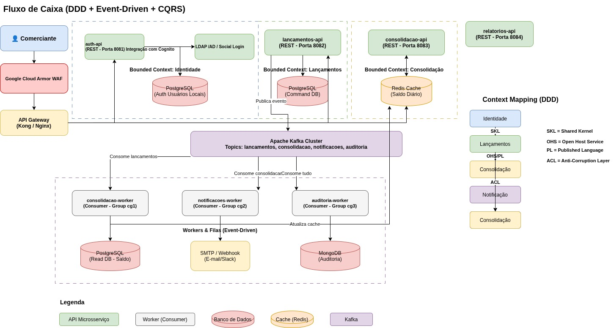

# CI&T Case - Fluxo de Caixa
####  Controle de fluxo de caixa diário com os lançamentos(débitos e créditos), também precisa de um relatório que disponibilize o saldo diário consolidado.

### Descrição do Event Storming - Fluxo de Caixa

#### 1. Visão Geral
O Event Storming é uma técnica de modelagem colaborativa que visa mapear todo o fluxo de negócio do sistema de Controle de Fluxo de Caixa, identificando comandos, eventos, agregados, atores, políticas, leituras e sistemas externos envolvidos no processo de registro de lançamentos e consolidação diária de saldos.

| Categoria  | Descrição |
| --- | ---  |
|Comandos |	Ações iniciadas pelo usuário ou sistema|
|Eventos de Domínio |	Ocorrências importantes no negócio |
|Agregados|	Entidades que garantem consistência transacional|
|Atores / Usuários|	Quem interage com o sistema|
|Políticas / Regras de Negócio|	Regras e validações do domínio|
|Leituras (CQRS)|	Consultas otimizadas separadas dos comandos|
|Sistemas Externos|	Infraestrutura e serviços de terceiros|

### 2. Atores / Usuários

| Atores  | Descrição | Responsabilidades |
| --- | --- |---|
| Comerciante | Usuário final do sitema| Registrar lançamentos, consultar saldos, cancelar lançamentos, exportar extratos |
|Administrador|	Gestor do sistema|	Gerar relatórios gerenciais, configurar limites de alerta, auditar operações|
|Sistema (Automático)|	Processos automatizados|	Disparar alertas de saldo baixo, atualizar caches, consolidar saldos|

###  3. Comandos

