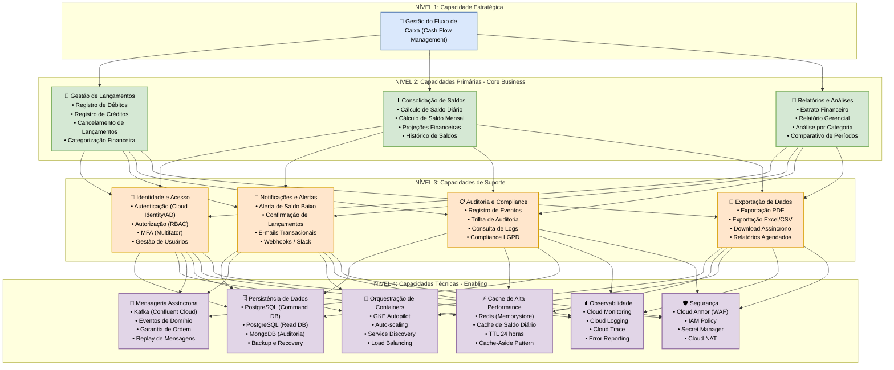

### Business Capability Modeling - Requisitos Funcionais e não Funcionais
##### Sumário


[1. Business Capability Modeling (BCM)](#business)\
[2. Mapeamento de Domínios Funcionais](#dominio)\
[3. Bounded Contexts (Contextos Delimitados)](#bounded)\
[4. Requisitos Funcionais Detalhados](#funcionais)\
[5. Requisitos Não Funcionais Detalhados](#no-funcionais)\

### 6. Diagrama BCM + Bounded Contexts




    
    


<a id="business"></a>
### 1. Business Capability Modeling
##### 1.1 Hierarquia de Capacidades de Negócio

```
┌─────────────────────────────────────────────────────────────────────────────────────┐
│                         Nível 1: Gestão de Fluxo de Caixa                           │
├─────────────────────────────────────────────────────────────────────────────────────┤
│                                                                                     │
│  ┌─────────────────────────────────────────────────────────────────────────────┐    │
│  │                      Nível 2: Capacidades Primárias                         │    │
│  ├─────────────────────────────────────────────────────────────────────────────┤    │
│  │                                                                             │    │
│  │  ┌─────────────────┐  ┌─────────────────┐  ┌─────────────────┐              │    │
│  │  │  Gestão de      │  │  Consolidação   │  │  Relatórios e   │              │    │
│  │  │  Lançamentos    │  │  de Saldos      │  │  Auditoria      │              │    │
│  │  └────────┬────────┘  └────────┬────────┘  └────────┬────────┘              │    │
│  │           │                    │                    │                       │    │
│  │           ▼                    ▼                    ▼                       │    │
│  │  ┌─────────────────────────────────────────────────────────────────────┐    │    │
│  │  │                      Nível 3: Capacidades de Suporte                │    │    │
│  │  ├─────────────────────────────────────────────────────────────────────┤    │    │
│  │  │                                                                     │    │    │
│  │  │  ┌───────────────┐  ┌───────────────┐  ┌───────────────────┐        │    │    │
│  │  │  │  Identidade   │  │  Notificações │  │  Infraestrutura   │        │    │    │
│  │  │  │  e Acesso     │  │  e Alertas    │  │  e Observabilidade│        │    │    │
│  │  │  └───────────────┘  └───────────────┘  └───────────────────┘        │    │    │
│  │  │                                                                     │    │    │
│  │  └─────────────────────────────────────────────────────────────────────┘    │    │
│  │                                                                             │    │
│  └─────────────────────────────────────────────────────────────────────────────┘    │
│                                                                                     │
└─────────────────────────────────────────────────────────────────────────────────────┘
```


### 1.2 Detalhamento das Capacidades de Negócio (Nível 1)
|Capacidade|	Descrição|	Dono |	Maturidade|	KPIs|
|--|--|--|--|--|
|Gestão de Fluxo de Caixa|	Gerenciar entradas e saídas financeiras do negócio|	Diretor Financeiro|	Otimizado|	Saldo diário, fluxo mensal|

### 1.3 Detalhamento das Capacidades Primárias (Nível 2)
|Capacidade|	Descrição|	Sub-capacidades|	Métricas de Negócio|
|--|--|--|--|
|Gestão de Lançamentos|	Registrar, alterar e cancelar movimentações financeiras| Registro de débitos Registro de créditos Cancelamento Categorização|Tempo médio de registro Taxa de cancelamento Volume por categoria|
|Consolidação de Saldos|	Calcular e manter saldos diários/mensais |	Cálculo diário Cálculo mensal Projeções Histórico | Precisão do saldo Tempo de consolidação Disponibilidade do dado |
|Relatórios e Auditoria| Gerar relatórios gerenciais e manter trilha de auditoria| Extrato periódico Relatório gerencial Trilha de auditoria Exportação de dados| Tempo de geração Conformidade Rastreabilidade|

### 1.4 Detalhamento das Capacidades de Suporte (Nível 3)
|Capacidade|	Descrição|	Sub-capacidades|Métricas|
|--|--|--|--|
|Identidade e Acesso|	Gerenciar autenticação e autorização de usuários| Login (Cloud Identity) Login (AD corporativo) MFA RBAC Tempo de login| Taxa de sucesso Tentativas inválidas |
|Notificações e Alertas|Enviar alertas e notificações aos usuários| Alerta de saldo baixo Confirmação de lançamento Relatório periódico| Tempo de entrega Taxa de abertura Alertas disparados|
|Infraestrutura e Observabilidade|Garantir disponibilidade e visibilidade do sistema|Monitoramento Logging Tracing Backup/DR| Uptime MTTR Latência P95|

<a id="dominio"></a>
### 2. Mapeamento de Domínios Funcionais
##### 2.1 Mapa de Domínios (Core, Supporting, Generic)

```
┌─────────────────────────────────────────────────────────────────────────────────────┐
│                              Mapa de Domínios - Fluxo de Caixa                      │
├─────────────────────────────────────────────────────────────────────────────────────┤
│                                                                                     │
│  ┌─────────────────────────────────────────────────────────────────────────────┐    │
│  │                         CORE DOMAIN (Diferencial Competitivo)               │    │
│  │  ┌─────────────────────────────────────────────────────────────────────┐    │    │
│  │  │                                                                     │    │    │
│  │  │  • Gestão de Lançamentos (registro, cancelamento, categorização)    │    │    │
│  │  │  • Consolidação de Saldos (cálculo em tempo real)                   │    │    │
│  │  │  • Relatórios Gerenciais (análises financeiras)                     │    │    │
│  │  │                                                                     │    │    │
│  │  └─────────────────────────────────────────────────────────────────────┘    │    │
│  └─────────────────────────────────────────────────────────────────────────────┘    │
│                                                                                     │
│  ┌─────────────────────────────────────────────────────────────────────────────┐    │
│  │                       SUPPORTING DOMAIN (Apoio ao Core)                     │    │
│  │  ┌─────────────────────────────────────────────────────────────────────┐    │    │
│  │  │                                                                     │    │    │
│  │  │  • Notificações e Alertas (e-mail, Slack, webhook)                  │    │    │
│  │  │  • Exportação de Dados (PDF, Excel, CSV)                            │    │    │
│  │  │  • Auditoria (trilha de eventos)                                    │    │    │
│  │  │                                                                     │    │    │
│  │  └─────────────────────────────────────────────────────────────────────┘    │    │
│  └─────────────────────────────────────────────────────────────────────────────┘    │
│                                                                                     │
│  ┌─────────────────────────────────────────────────────────────────────────────┐    │
│  │                        GENERIC DOMAIN (Comoditizado)                        │    │
│  │  ┌─────────────────────────────────────────────────────────────────────┐    │    │
│  │  │                                                                     │    │    │
│  │  │  • Identidade e Autenticação (Cloud Identity + AD)                  │    │    │
│  │  │  • Mensageria (Kafka)                                               │    │    │
│  │  │  • Cache (Redis)                                                    │    │    │
│  │  │  • Persistência (PostgreSQL, MongoDB)                               │    │    │
│  │  │  • Observabilidade (Google Cloud Observability)                     │    │    │
│  │  │                                                                     │    │    │
│  │  └─────────────────────────────────────────────────────────────────────┘    │    │
│  └─────────────────────────────────────────────────────────────────────────────┘    │
│                                                                                     │
└─────────────────────────────────────────────────────────────────────────────────────┘
```

### 2.2 Matriz de Domínios x Capacidades

|Capacidade de Negócio|	Domínio Lançamentos|	Domínio Consolidação|	Domínio Relatórios|	Domínio Notificações|	Domínio Auditoria|	Domínio Identidade|
|--|--|--|--|--|--|--|
|Gestão de Lançamentos|	✅| Core|	❌|	❌|	⚪ Apoio|	⚪ Apoio|	❌|
Consolidação de Saldos|	❌|	✅| Core|	❌|	⚪ Apoio|	⚪ Apoio|	❌|
Relatórios e Análises|	❌|	⚪ Apoio|	✅| Core|	❌|	⚪ Apoio|	❌|
Identidade e Acesso|	⚪ Apoio	|⚪ Apoio	|⚪ Apoio	|⚪ Apoio	|⚪ Apoio|	✅ |Core|
Notificações|	⚪ Apoio|	⚪ Apoio|	❌|	✅ |Core	|❌	|❌|
Auditoria|	⚪ Apoio|	⚪ Apoio|	⚪ Apoio|	✅| Core|	❌|
###### Legenda: ✅ Core = Responsabilidade principal | ⚪ Apoio = Suporta a capacidade | ❌ = Não relacionado


<a id="bounded"></a>
### 3. Bounded Contexts (Contextos Delimitados)
##### 3.1 Mapa de Contextos Delimitados
```
┌─────────────────────────────────────────────────────────────────────────────────────┐
│                         Bounded Contexts - Fluxo de Caixa                           │
├─────────────────────────────────────────────────────────────────────────────────────┤
│                                                                                     │
│  ┌─────────────────────────────────────────────────────────────────────────────┐    │
│  │                                                                             │    │
│  │  ┌─────────────────────┐          ┌─────────────────────┐                   │    │
│  │  │   Contexto:         │          │   Contexto:         │                   │    │
│  │  │   Identidade        │◄──────── │   Lançametos        │                   │    │
│  │  │                     │  (SKL)   │                     │                   │    │
│  │  │  • Cloud Identity   │          │  • Registro         │                   │    │
│  │  │  • Active Directory │          │  • Cancelamento     │                   │    │
│  │  │  • Autenticação     │          │  • Categorização    │                   │    │
│  │  │  • Autorização      │          │                     │                   │    │
│  │  └─────────────────────┘          └──────────┬──────────┘                   │    │
│  │                                              │                              │    │
│  │                                              │ (OHS/PL)                     │    │
│  │                                              ▼                              │    │
│  │                               ┌─────────────────────┐                       │    │
│  │                               │   Contexto:         │                       │    │
│  │                               │   Consolidação      │                       │    │
│  │                               │                     │                       │    │
│  │                               │  • Cálculo diário   │                       │    │
│  │                               │  • Cálculo mensal   │                       │    │
│  │                               │  • Projeções        │                       │    │
│  │                               └──────────┬──────────┘                       │    │
│  │                                          │                                  │    │
│  │                    ┌─────────────────────┼─────────────────────┐            │    │
│  │                    │ (ACL)               │ (OHS)               │ (ACL)      │    │
│  │                    ▼                     ▼                     ▼            │    │
│  │  ┌─────────────────────┐  ┌─────────────────────┐  ┌─────────────────────┐  │    │
│  │  │   Contexto:         │  │   Contexto:         │  │   Contexto:         │  │    │
│  │  │   Notificações      │  │   Relatórios        │  │   Auditoria         │  │    │
│  │  │                     │  │                     │  │                     │  │    │
│  │  │  • Alertas          │  │  • Extratos         │  │  • Eventos          │  │    │
│  │  │  • E-mails          │  │  • Relatórios       │  │  • Logs             │  │    │
│  │  │  • Webhooks         │  │  • Exportação       │  │  • Compliance       │  │    │
│  │  └─────────────────────┘  └─────────────────────┘  └─────────────────────┘  │    │
│  │                                                                             │    │
│  └─────────────────────────────────────────────────────────────────────────────┘    │ 
│                                                                                     │
│  Legenda:                                                                           │
│  • SKL = Shared Kernel (Kernel Compartilhado)                                       │
│  • OHS = Open Host Service (Serviço Aberto)                                         │
│  • PL = Published Language (Linguagem Publicada)                                    │
│  • ACL = Anti-Corruption Layer (Camada Anti-Corrupção)                              │
│                                                                                     │
└─────────────────────────────────────────────────────────────────────────────────────┘

```

### 3.2 Priorização por Domínio
```
┌─────────────────────────────────────────────────────────────────────────────────────┐
│                              HEATMAP DE PRIORIZAÇÃO                                 │
├─────────────────────────────────────────────────────────────────────────────────────┤
│                                                                                     │
│  Domínio            │ Impacto Negócio │ Complexidade │ Risco │ Prioridade Final     │
│─────────────────────┼─────────────────┼──────────────┼───────┼──────────────────────┤
│  Lançamentos        │ 🔴 Muito Alto   │ 🟡 Médio     │ 🟡 M  │ 🔴 PRIORIDADE 1     │
│  Consolidação       │ 🔴 Muito Alto   │ 🟡 Médio     │ 🟡 M  │ 🔴 PRIORIDADE 1     │
│  Relatórios         │ 🟠 Alto         │ 🟢 Baixo     │ 🟢 B  │ 🟠 PRIORIDADE 2     │
│  Identidade         │ 🔴 Muito Alto   │ 🟡 Médio     │ 🔴 A  │ 🔴 PRIORIDADE 1     │
│  Notificações       │ 🟡 Médio        │ 🟢 Baixo     │ 🟢 B  │ 🟢 PRIORIDADE 3     │
│  Auditoria          │ 🟠 Alto         │ 🟢 Baixo     │ 🟡 M  │ 🟠 PRIORIDADE 2     │
│                                                                                    │
└────────────────────────────────────────────────────────────────────────────────────┘

Legenda:
🔴 = Alta / Muito Alto
🟠 = Médio-Alto
🟡 = Médio
🟢 = Baixo


```

### 3.3 Detalhamento dos Bounded Contexts

|Bounded Context|	Responsabilidade|	Aggregate Root|	Eventos|	API|
|--|--|--|--|--|
|Identidade|	Autenticação e autorização|	Usuário|	UsuarioAutenticado, UsuarioRegistrado	|auth-api|
|Lançamentos|	CRUD de movimentações|	Lancamento|	LancamentoRegistrado, LancamentoCancelado|	lancamentos-api|
|Consolidação|	Cálculo de saldos|	SaldoDiario|	SaldoDiarioAtualizado, SaldoBaixoAlertado|	consolidacao-api|
|Notificações|	Envio de alertas|	Notificacao|	AlertaEnviado, EmailEnviado|	notificacoes-worker|
|Relatórios|	Geração de documentos|	RelatorioPeriodo|	RelatorioGerado|	relatorios-api|
|Auditoria|	Trilha de eventos|	EventoAuditoria|	EventoRegistrado|	auditoria-worker|


### 3.4 Context Mapping (Tabela de Relacionamentos)

|Contexto Origem|	Contexto Destino|	Tipo de Relacionamento|Justificativa|
|--|--|--|--|
|Identidade|	Lançamentos|	Shared Kernel (SKL)|	Compartilham modelo de Usuário|
|Lançamentos|	Consolidação|	Open Host Service (OHS) + Published Language (PL)|	Eventos públicos via Kafka|
|Consolidação|	Notificações|	Anti-Corruption Layer (ACL)|	Traduz eventos para formato de notificação|
|Consolidação|	Relatórios|	Open Host Service (OHS)|	Fornece dados consolidados|
|Lançamentos|	Auditoria|	Anti-Corruption Layer (ACL)|	Registra todos os eventos|

### 3.5 Linguagem Ubíqua por Contexto

|Contexto|	Termos Ubíquos|
|--|--|
|Identidade|	Usuário, Comerciante, Autenticação, Autorização, Role, Permissão, Login, Logout, MFA|
|Lançamentos|	Lançamento, Débito, Crédito, Valor, DataHora, Descrição, Categoria, Estabelecimento, Status, Cancelamento|
|Consolidação|	SaldoDiário, SaldoMensal, TotalCréditos, TotalDébitos, QuantidadeTransações, Data, Consolidado|
|Notificações|	Alerta, E-mail, Slack, Webhook, Destinatário, Mensagem, Template, Disparo|
|Relatórios|	Extrato, Período, RelatórioGerencial, PDF, Excel, Exportação, Filtro|
|Auditoria|	Evento, Log, Trilha, Origem, Dados, Timestamp, Usuário, Ação|


<a id="funcionais"></a>
### 4. Requisitos Funcionais Detalhados
##### 4.1 Requisitos por Contexto Delimitado

##### Contexto: Identidade
|ID|	Requisito|	Descrição|	Prioridade |Critério de Aceitação|
|--|--|--|--|--|
|RF-ID-01|Login com Cloud Identity|	Autenticar usuário via Google Cloud Identity|	Must Have|	Login bem sucedido com credenciais válidas|
|RF-ID-02|Login com Active Directory|	Autenticar usuário via LDAP/Kerberos|	Must Have|	Login via domínio corporativo|
|RF-ID-03|Autenticação Multifator (MFA)|	Suporte a MFA via SMS ou TOTP|	Should Have |	Usuário deve fornecer segundo fator|
|RF-ID-04|Registro de Usuário|	Criar nova conta de comerciante|	Must Have |	Dados validados e persistidos |
|RF-ID-05|Refresh Token|Renovar token de acesso|Must Have|	Token expirado pode ser renovado|
|RF-ID-06|Logout|	Invalidar token de acesso|	Must Have	|Token não pode mais ser usado|
|RF-ID-07|RBAC (Role-Based Access Control)|	Controle de acesso baseado em papéis|	Must Have|	Administrador e Comerciante com permissões distintas|
|RF-ID-08|Recuperação de Senha|	Enviar e-mail para redefinição de senha|	Should Have|	Link válido por 1 hora|

##### Contexto: Lançamentos
|ID|	Requisito|	Descrição|	Prioridade |Critério de Aceitação|
|--|--|--|--|--|
|RF-LC-01|	Registrar Débito|	Criar lançamento de saída financeira|	Must Have|	Valor |subtraído do saldo|
|RF-LC-02|	Registrar Crédito|	Criar lançamento de entrada financeira|	Must Have|	Valor |adicionado ao saldo|
|RF-LC-03|	Listar Lançamentos|	Listar lançamentos com filtros|	Must Have|	Paginação, ordenação por data|
|RF-LC-04|	Obter Lançamento por ID|	Buscar detalhes de um lançamento|	Must Have|	Retornar 404 se não existir|
|RF-LC-05|	Cancelar Lançamento|	Estornar lançamento existente|	Must Have|	Status alterado para CANCELADO|
|RF-LC-06|	Categorizar Lançamento|	Associar categoria ao lançamento|	Should Have|	Filtro por categoria|
|RF-LC-07|	Editar Lançamento|	Alterar dados de um lançamento|	Should Have|	Apenas lançamentos não consolidados|
|RF-LC-08|	Lançamento Recorrente|	Criar lançamentos automáticos periódicos|	Could Have|	Configuração de periodicidade|

##### Contexto: Consolidação
|ID|	Requisito|	Descrição|	Prioridade |Critério de Aceitação|
|--|--|--|--|--|
|RF-CS-01|	Consultar Saldo Diário|	Obter saldo consolidado por data	|Must Have|	Retorna saldo calculado|
|RF-CS-02|	Consultar Saldo Mensal|	Obter saldo consolidado por mês	|Must Have|	Retorna saldo inicial e final|
|RF-CS-03|	Histórico de Saldos|	Listar saldos de um período	|Should Have|	Gráfico de evolução|
|RF-CS-04|	Projeção de Saldo|	Prever saldo futuro baseado em padrões	|Could Have|	Baseado em média histórica|
|RF-CS-05|	Recalcular Saldo|	Forçar recálculo de um período	|Should Have|	Administrador apenas|
|RF-CS-06|	Exportar Consolidado|	Exportar saldos para CSV	|Should Have|	Formato estruturado|


##### Contexto: Notificação
|ID|	Requisito|	Descrição|	Prioridade |Critério de Aceitação|
|--|--|--|--|--|
|RF-NT-01|	Alerta de Saldo Baixo	Notificar quando saldo < limite	|Must Have|	E-mail enviado em até 1 minuto|
|RF-NT-02|	Confirmação de Lançamento	Notificar quando lançamento é criado	|Should Have|	E-mail opcional|
|RF-NT-03|	Notificação por Slack	Enviar alertas via webhook do Slack	|Could Have|	Mensagem formatada|
|RF-NT-04|	Relatório Periódico	Enviar relatório por e-mail agendado	|Could Have|	Diário, semanal ou mensal|
|RF-NT-05|	Configurar Limite de Alerta	Usuário define limite personalizado	|Should Have|	Persistir preferência|

##### Contexto: Relatórios
|ID|	Requisito|	Descrição|	Prioridade |Critério de Aceitação|
|--|--|--|--|--|
|RF-RL-01|	Extrato Período|	Gerar extrato financeiro	|Must Have|	PDF ou Excel|
|RF-RL-02|	Relatório por Categoria|	Agrupar lançamentos por categoria	|Should Have|	Gráficos e totais|
|RF-RL-03|	Relatório Comparativo|	Comparar períodos distintos	|Could Have|	Ano anterior vs atual|
|RF-RL-04|	Download Assíncrono|	Gerar relatório em background	|Should Have|	Notificar quando pronto|


##### Contexto: Auditoria
|ID|	Requisito|	Descrição|	Prioridade |Critério de Aceitação|
|--|--|--|--|--|
|RF-AU-01|	Registrar Eventos|	Todos os eventos de domínio são registrados	|Must Have|	Log persistido em MongoDB|
|RF-AU-02|	Consultar Trilha|	Buscar eventos por usuário/período	|Should Have|	Filtros e paginação|
|RF-AU-03|	Exportar Auditoria|	Exportar logs para CSV/JSON	|Could Have|	Formato estruturado|
|RF-AU-04|	Retenção Configurável|	Configurar tempo de retenção dos logs|Should Have|	Política por tipo de evento|


<a id="no-funcionais"></a>
### 5. Requisitos Não Funcionais Detalhados
##### Requisitos de Performance

|ID|	Requisito|	Descrição|	Métrica|	Alvo|
|--|--|--|--|--|
|RNF-PF-01|	Latência de API|	Tempo de resposta das APIs|	P95|	< 500ms|
|RNF-PF-02|	Throughput|	Requisições simultâneas	|Requests/segundo|	10.000|
|RNF-PF-03|	Tempo de Consolidação|	Tempo para atualizar saldo|	Segundos|	< 5s|
|RNF-PF-04|	Tempo de Cache|	Tempo de leitura do Redis|	P95|	< 10ms|
|RNF-PF-05|	Tempo de Relatório|	Geração de relatório PDF|	Máximo|	< 10s|
|RNF-PF-06|	Tempo de Login|	Autenticação completa|	P95|	< 2s|

### 5.2 Requisitos de Disponibilidade

|ID|	Requisito|	Descrição|	Métrica|	Alvo|
|--|--|--|--|--|
|RNF-DP-01|	Uptime API|	Disponibilidade das APIs|	Percentual|	99.9%|
|RNF-DP-02|	Uptime Workers|	Disponibilidade dos workers|	Percentual|	99.5%|
|RNF-DP-03|	Uptime Banco de Dados|	Disponibilidade PostgreSQL|	Percentual|	99.95%|
|RNF-DP-04|	Manutenção Programada|	Janela para manutenção|	Horário|	Domingo 2h-4h|
|RNF-DP-05|	Failover Automático|	Recuperação de falhas|	Tempo	|< 5 minutos|

### 5.3 Requisitos de Escalabilidade
|ID|	Requisito|	Descrição|	Métrica|	Alvo|
|--|--|--|--|--|
|RNF-ES-01|	Escala Horizontal|	Adicionar réplicas automaticamente|	Auto-scaling|	Baseado em CPU/memória|
|RNF-ES-02|	Limite de Conexões|	Máximo de conexões simultâneas|	Conexões|	50.000|
|RNF-ES-03|	Tamanho do Banco|	Capacidade de armazenamento|	GB|	Ilimitado (escalável)|
|RNF-ES-04|	Partição de Dados|	Sharding por usuário	|Estratégia	|Por tenant|

### 5.4 Requisitos de Segurança
|ID|	Requisito|	Descrição|	Implementação|
|--|--|--|--|
|RNF-SG-01|	Autenticação|	Verificação de identidade	|Cloud Identity + AD + MFA|
|RNF-SG-02|	Autorização|	Controle de acesso baseado em papéis	|JWT com claims|
|RNF-SG-03|	Criptografia em Trânsito|	Dados trafegados criptografados|	TLS 1.3|
|RNF-SG-04|	Criptografia em Repouso|	Dados armazenados criptografados|	AES-256|
|RNF-SG-05|	Proteção WAF|	Proteção contra ataques web	|Google Cloud |Armor|
|RNF-SG-06|	Rate Limiting|	Limitar requisições por IP/usuário|	100 req/minuto|
|RNF-SG-07|	Auditabilidade|	Todas as ações rastreáveis|	MongoDB + Cloud Logging|
|RNF-SG-08|	Isolamento de Dados|	Dados isolados por tenant|	Tenant ID nas queries|

### 5.5 Requisitos de Resiliência
|ID|	Requisito|	Descrição|	Estratégia|
|--|--|--|--|
|RNF-RS-01|	Circuit Breaker|	Prevenir falhas em cascata|	Polly (3 falhas / 30-60s)|
|RNF-RS-02|	Retry com Backoff|	Tentar novamente em caso de falha|	Exponential backoff|
|RNF-RS-03|	Timeout|	Limite de tempo para operações|	10s (APIs), 30s (workers)|
|RNF-RS-04|	Bulkhead|	Isolar recursos críticos|	Pool de conexões|
|RNF-RS-05|	Fallback|	Resposta alternativa em caso de falha|	Dados cacheados|


### 5.6 Requisitos de Recuperação de Desastres (DR)
|ID|	Requisito|	Descrição|	Métrica|	Alvo|
|--|--|--|--|--|
|RNF-DR-01|	RPO (Recovery Point Objective)|	Perda máxima de dados|	Tempo	< 15 minutos|
|RNF-DR-02|	RTO (Recovery Time Objective)|	Tempo para restaurar serviço|	Tempo	< 1 hora|
|RNF-DR-03|	Backup Automático|	Frequência de backup	Frequência|	Diário|
|RNF-DR-04|	Multi-Region|	Réplicas em múltiplas regiões	Regiões|	us-central1, us-east1|


### 5.5 Requisitos de Observabilidade
|ID|	Requisito|	Descrição|	Ferramentas|
|--|--|--|--|
|RNF-OB-01|	Métricas Customizadas|	Coletar métricas de negócio	|Cloud Monitoring|
|RNF-OB-02|	Distributed Tracing|	Rastrear requisições entre serviços|	Cloud Trace|
|RNF-OB-03|	Centralização de Logs|	Agregar logs de todos os serviços|	Cloud Logging|
|RNF-OB-04|	Alertas Proativos|	Alertar antes de falhas	|Cloud Monitoring + PagerDuty|
|RNF-OB-05|	Dashboards|	Visualização em tempo real	|Grafana + Cloud Monitoring|
|RNF-OB-06|	Health Checks|	Endpoints de verificação de saúde	|/health, /ready|


### 5.8 Requisitos de Compliance
|ID|	Requisito|	Descrição|	Norma|
|--|--|--|--|
|RNF-CP-01|	LGPD|	Proteção de dados pessoais	|Lei Geral de Proteção de Dados|
|RNF-CP-02|	Retenção de Logs|	Manter logs por período definido|	7 anos (financeiro)|
|RNF-CP-03|	Consentimento|	Registro de consentimento do usuário|	LGPD|
|RNF-CP-04|	Direito ao Esquecimento|	Exclusão de dados do usuário|	LGPD|

